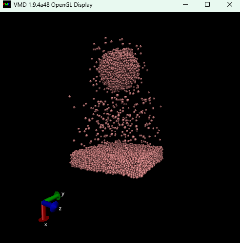

# ミルククラウン作成用スクリプト

## 使い方

二つのファイルを入力として、atomsファイルを作る。

```sh
python3 compose.py collision.droplet collision.wall milkcrown.atoms 
```

作ったatomsファイルをLAMMPSに入力し、lammpstrjファイルを作る。

```sh
lmp_serial < milkcrown.input
```

できた`milkcrown.lammpstrj`をVMDで見る。

